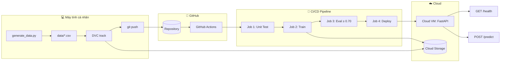

# 📋 Kế Hoạch Hoàn Thành Lab: CI/CD cho AI Systems

## 📌 Tổng Quan

| Thông tin           | Giá trị                       |
| ------------------- | ----------------------------- |
| **Môn học**         | AIInAction - VinUni           |
| **Buổi**            | Day 21 - CI/CD cho AI Systems |
| **Dataset**         | Wine Quality (UCI) - 6497 mẫu |
| **Model**           | RandomForestClassifier        |
| **Tracking**        | MLflow (SQLite backend)       |
| **Data Versioning** | DVC + Cloud Object Storage    |
| **CI/CD**           | GitHub Actions (4 jobs)       |
| **Serving**         | FastAPI trên Cloud VM         |

---

## 🧱 Kiến Trúc Tổng Thể



---

## 🚶 Các Bước Thực Hiện

### 🔵 BƯỚC 1: Thực Nghiệm Cục Bộ (Local)

> **Trạng thái hiện tại:** ✅ Code đã viết sẵn, cần chạy thí nghiệm

| STT | Công việc                | Chi tiết                                                                                           |        File liên quan         | Trạng thái |
| :-: | ------------------------ | :------------------------------------------------------------------------------------------------- | :---------------------------: | :--------: |
| 1.1 | Cài đặt môi trường       | `python -m venv .venv` && kích hoạt && `pip install -r requirements.txt`                           |      `requirements.txt`       |     ⏳     |
| 1.2 | Tạo dữ liệu              | `python generate_data.py` → `train_phase1.csv` (2998), `eval.csv` (500), `train_phase2.csv` (2998) |      `generate_data.py`       |     ⏳     |
| 1.3 | Cấu hình MLflow          | Set `MLFLOW_TRACKING_URI=sqlite:///mlflow.db` và `MLFLOW_ARTIFACT_ROOT=./mlartifacts`              |               -               |     ⏳     |
| 1.4 | Chạy thí nghiệm #1       | `params.yaml`: `n_estimators: 50, max_depth: 3` → `python src/train.py`                            | `params.yaml`, `src/train.py` |     ⏳     |
| 1.5 | Chạy thí nghiệm #2       | `params.yaml`: `n_estimators: 100, max_depth: 5` → `python src/train.py`                           | `params.yaml`, `src/train.py` |     ⏳     |
| 1.6 | Chạy thí nghiệm #3       | `params.yaml`: `n_estimators: 200, max_depth: 10, min_samples_split: 5` → `python src/train.py`    | `params.yaml`, `src/train.py` |     ⏳     |
| 1.7 | Chạy thêm 1-2 thí nghiệm | Thử `n_estimators: 200, max_depth: null` hoặc `n_estimators: 100, max_depth: 10`                   |         `params.yaml`         |     ⏳     |
| 1.8 | So sánh kết quả          | `mlflow ui` → UI hiển thị tất cả runs, chọn bộ params tốt nhất                                     |          `mlflow.db`          |     ⏳     |
| 1.9 | Chạy unit test           | `pytest tests/ -v` → cả 3 test phải pass                                                           |     `tests/test_train.py`     |     ⏳     |

**Kết quả Bước 1:** ✅ Chọn được bộ siêu tham số tốt nhất cho Bước 2

---

### 🟢 BƯỚC 2: Pipeline CI/CD Tự Động

> **Trạng thái hiện tại:** ✅ Code workflow đã viết sẵn, cần tạo cloud resources

| STT  | Công việc                   | Chi tiết                                                                                                             |           Lệnh/File           | Trạng thái |
| :--: | --------------------------- | :------------------------------------------------------------------------------------------------------------------- | :---------------------------: | :--------: |
| 2.1  | Chọn Cloud Provider         | Chọn **GCP** / AWS / Azure (khuyến nghị GCP vì code mẫu)                                                             |               -               |     ⏳     |
| 2.2  | Tạo Cloud Storage Bucket    | `gsutil mb -p $PROJECT -l us-central1 gs://$BUCKET`                                                                  |               -               |     ⏳     |
| 2.3  | Tạo Service Account & Key   | `gcloud iam service-accounts create mlops-lab-sa` + cấp quyền + xuất key                                             |         `sa-key.json`         |     ⏳     |
| 2.4  | Cài đặt DVC remote          | `dvc init` + `dvc remote add -d myremote gs://$BUCKET/dvc` + `dvc remote modify myremote credentialpath sa-key.json` |         `.dvc/config`         |     ⏳     |
| 2.5  | Track dữ liệu với DVC       | `dvc add data/train_phase1.csv data/eval.csv data/train_phase2.csv`                                                  |          `*.csv.dvc`          |     ⏳     |
| 2.6  | Push dữ liệu lên cloud      | `dvc push` → file CSV được upload lên bucket                                                                         |               -               |     ⏳     |
| 2.7  | Commit DVC files vào git    | `git add data/*.dvc .gitignore .dvc/config && git commit -m "feat: track datasets with DVC"`                         |              Git              |     ⏳     |
| 2.8  | Tạo Cloud VM                | `gcloud compute instances create mlops-serve ...`                                                                    |               -               |     ⏳     |
| 2.9  | Mở firewall port 8000       | `gcloud compute firewall-rules create allow-mlops-serve --allow=tcp:8000 --target-tags=mlops-serve`                  |               -               |     ⏳     |
| 2.10 | SSH vào VM cài đặt thư viện | `pip3 install fastapi uvicorn scikit-learn joblib google-cloud-storage`                                              |               -               |     ⏳     |
| 2.11 | Copy key lên VM             | `gcloud compute scp sa-key.json mlops-serve:~/sa-key.json`                                                           |               -               |     ⏳     |
| 2.12 | Tạo systemd service trên VM | Tạo file `/etc/systemd/system/mlops-serve.service` tự động chạy `src/serve.py`                                       |               -               |     ⏳     |
| 2.13 | Push code lên GitHub        | `git add . && git commit -m "feat: add CI/CD pipeline" && git push origin main`                                      | `.github/workflows/mlops.yml` |     ⏳     |
| 2.14 | Cấu hình GitHub Secrets     | Thêm vào repo Settings → Secrets and variables → Actions:                                                            |               -               |     ⏳     |

**GitHub Secrets cần cấu hình:**

| Secret              |                                                          Giá trị | Mô tả                     |
| :------------------ | ---------------------------------------------------------------: | ------------------------- |
| `CLOUD_CREDENTIALS` |                                      Nội dung file `sa-key.json` | Service account key (GCP) |
| `CLOUD_BUCKET`      |                           Tên bucket (VD: `mlops-lab-wine-2024`) | Bucket chứa data/model    |
| `VM_HOST`           |                                              IP công khai của VM | VD: `34.123.45.67`        |
| `VM_USER`           |     Tên user SSH (thường là `nanganh` hoặc tên GCP user của bạn) | User trên VM              |
| `VM_SSH_KEY`        | Private key SSH (nội dung file `~/.ssh/id_rsa` hoặc tương đương) | Để SSH vào VM             |

| STT  | Công việc (tiếp)                      | Chi tiết                                                                      | Trạng thái |
| :--: | ------------------------------------- | :---------------------------------------------------------------------------- | :--------: |
| 2.15 | Theo dõi pipeline trên GitHub Actions | Vào tab Actions → kiểm tra 4 jobs chạy thành công                             |     ⏳     |
| 2.16 | Start service trên VM                 | `gcloud compute ssh mlops-serve --command "sudo systemctl start mlops-serve"` |     ⏳     |
| 2.17 | Kiểm tra API                          | `curl http://$VM_IP:8000/health` + `curl -X POST ... /predict`                |     ⏳     |

**Kết quả Bước 2:** ✅ Pipeline CI/CD hoạt động → Model được deploy lên VM

---

### 🟠 BƯỚC 3: Huấn Luyện Liên Tục

> **Trạng thái hiện tại:** ✅ Code đã viết sẵn, cần thực hiện quy trình

| STT | Công việc              | Chi tiết                                                                                   |           Lệnh/File           | Trạng thái |
| :-: | ---------------------- | :----------------------------------------------------------------------------------------- | :---------------------------: | :--------: |
| 3.1 | Thêm dữ liệu mới       | `python add_new_data.py` → gộp `train_phase2.csv` vào `train_phase1.csv` (2998 → 5996 mẫu) |       `add_new_data.py`       |     ⏳     |
| 3.2 | Cập nhật DVC           | `dvc add data/train_phase1.csv` → cập nhật file `.dvc`                                     |  `data/train_phase1.csv.dvc`  |     ⏳     |
| 3.3 | Commit DVC file        | `git add data/train_phase1.csv.dvc && git commit -m "data: bổ sung 2998 mẫu dữ liệu mới"`  |              Git              |     ⏳     |
| 3.4 | Push dữ liệu lên cloud | `dvc push` → đẩy file CSV mới lên bucket                                                   |               -               |     ⏳     |
| 3.5 | Push code lên GitHub   | `git push origin main` → **tự động kích hoạt pipeline**                                    | `.github/workflows/mlops.yml` |     ⏳     |
| 3.6 | Theo dõi pipeline      | Tab Actions → pipeline chạy với dữ liệu 5996 mẫu                                           |            GitHub             |     ⏳     |
| 3.7 | Kiểm tra endpoint      | `curl http://$VM_IP:8000/health` + `/predict`                                              |              VM               |     ⏳     |
| 3.8 | So sánh kết quả        | Điền bảng so sánh accuracy/f1 giữa Bước 2 và Bước 3                                        |               -               |     ⏳     |

**Kết quả Bước 3:** ✅ Pipeline tự động kích hoạt khi có dữ liệu mới → Model mới được deploy

---

## 📊 So Sánh Kết Quả (Điền sau khi hoàn thành)

| Chỉ số       | Bước 2 (2998 mẫu) | Bước 3 (5996 mẫu) | Nhận xét |
| :----------- | ----------------: | ----------------: | :------- |
| **accuracy** |                 ? |                 ? | ?        |
| **f1_score** |                 ? |                 ? | ?        |

---

## ✅ Checklist Tổng Kết

### Bước 1

- [ ] Cài đặt môi trường & thư viện
- [ ] Tạo dữ liệu với `generate_data.py`
- [ ] Chạy ít nhất 3 thí nghiệm với MLflow
- [ ] So sánh kết quả trên MLflow UI
- [ ] `pytest tests/ -v` pass 3/3
- [ ] Chọn bộ params tốt nhất

### Bước 2

- [ ] Tạo Cloud Storage bucket
- [ ] Tạo Service Account + key
- [ ] Cấu hình DVC remote
- [ ] Track & push dữ liệu lên cloud
- [ ] Tạo Cloud VM + mở firewall
- [ ] Cài đặt thư viện trên VM
- [ ] Copy key lên VM
- [ ] Tạo systemd service trên VM
- [ ] Cấu hình GitHub Secrets (5 secrets)
- [ ] Push code → pipeline chạy thành công
- [ ] Test API (GET /health + POST /predict)

### Bước 3

- [ ] Chạy `add_new_data.py`
- [ ] Cập nhật DVC
- [ ] `dvc push` trước, `git push` sau
- [ ] Pipeline tự động kích hoạt
- [ ] 4 jobs hoàn thành thành công
- [ ] API trả về kết quả từ model mới
- [ ] Điền bảng so sánh kết quả

---

## 🔧 Cấu Trúc Thư Mục Sau Khi Hoàn Thành

```
Day21-Track2-CI-CD-for-AI-Systems/
├── .github/workflows/mlops.yml    # CI/CD Pipeline (4 jobs)
├── data/
│   ├── train_phase1.csv            # Dữ liệu huấn luyện
│   ├── train_phase2.csv            # Dữ liệu bổ sung
│   ├── eval.csv                    # Dữ liệu đánh giá
│   ├── train_phase1.csv.dvc        # DVC pointer (tracked by git)
│   ├── train_phase2.csv.dvc
│   └── eval.csv.dvc
├── models/
│   └── model.pkl                   # Model đã huấn luyện
├── outputs/
│   └── metrics.json                # Metrics (accuracy, f1_score)
├── src/
│   ├── __init__.py
│   ├── train.py                    # Huấn luyện model
│   └── serve.py                    # FastAPI serving
├── tests/
│   ├── __init__.py
│   └── test_train.py               # 3 unit tests
├── tasks/
│   ├── buoc-1.md                   # Hướng dẫn Bước 1
│   ├── buoc-2.md                   # Hướng dẫn Bước 2
│   └── buoc-3.md                   # Hướng dẫn Bước 3
├── params.yaml                     # Siêu tham số
├── requirements.txt                # Dependencies
├── generate_data.py                # Sinh dữ liệu
├── add_new_data.py                 # Thêm dữ liệu mới
├── .dvc/config                     # DVC config
├── mlflow.db                       # MLflow tracking DB
└── sa-key.json                     # 🔴 KHÔNG COMMIT (đã trong .gitignore)
```

---

## 🆘 Xử Lý Sự Cố Thường Gặp

| Vấn đề                        | Nguyên nhân                             | Giải pháp                                               |
| :---------------------------- | --------------------------------------- | :------------------------------------------------------ |
| `dvc push` lỗi xác thực       | Chưa set `credentialpath`               | `dvc remote modify myremote credentialpath sa-key.json` |
| `dvc pull` thất bại trên CI   | Secret `CLOUD_CREDENTIALS` không hợp lệ | Kiểm tra lại nội dung secret trong GitHub Settings      |
| Job Deploy thất bại           | Accuracy là string, so sánh sai kiểu    | Dùng `float()` trong eval gate                          |
| Pipeline không kích hoạt ở B3 | Commit nhầm file `.csv` thay vì `.dvc`  | `git log --name-only -1` để kiểm tra                    |
| Service không khởi động       | Thiếu `GOOGLE_APPLICATION_CREDENTIALS`  | Set env trong systemd service                           |
